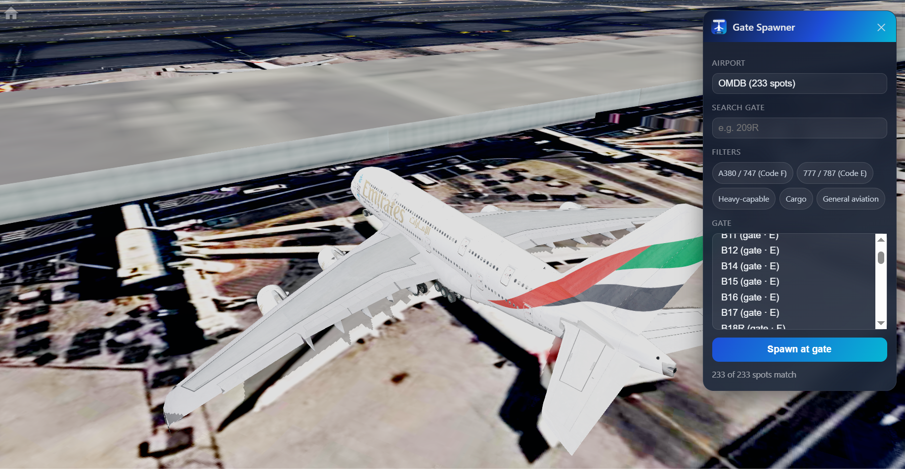

# [Click here to Install/Update](https://raw.githubusercontent.com/machpoint82/geofs-gate-spawner/main/geofs-gate-spawner.user.js)

## Update 3.4.0, Spawn without GeoFs tab reloading, you get teleported directly to the stand

  

  

<h1 align="center">GeoFS Gate Spawner</h1>

Spawn parked at a real gate or stand at supported airports.

  
  
  
  

---

## What it does

Adds a small in-game panel to GeoFS where you can pick an airport and gate/stand and spawn there

## Features

- Search box — type a gate number and hit **Enter** to jump straight there
- Filters for Code F (A380/747), Code E (777/787), heavy-capable, cargo, and general aviation stands
- The panel lives as a small square always-visible in the bottom right corner — click it to expand/collapse. No setup required.
- Auto-updates through Tampermonkey once installed
- Best-effort anti-creep fix: automatically holds the parking brake for a few seconds after spawning, since some gates can have the aircraft roll forward slightly before physics settles

## Current airport coverage

**Right now this covers [500+ airports](airports.txt)** More airports will be added over time — check back on this repo for updates, and the script will auto-update itself once new airports are added to [`gates.json`](gates.json).
[Airports Coverage](Airports%20Coverage.txt) for full list.
## Requesting an Airport

Want to see a specific airport added to the gate spawner? Submit an Airport Request using the link below — just fill in the ICAO code, airport name, region, and any extra details (gate layout sources, parking charts, etc.), and it'll come through directly as an issue.

👉  [Submit an Airport Request](https://github.com/machpoint82/geofs-gate-spawner/issues/new?template=airport_request.md)

 👉 [Request a feature here](https://github.com/machpoint82/geofs-gate-spawner/issues/new?template=feature_request.md)

- ⚠️ Gate coordinates come from open, community-maintained airport data, — the vast majority line up correctly, but a small number of stands may be positioned slightly off, or the aircraft may creep forward a little after spawning before settling.
- ⚠️ Some parking spots in the source data don't include aircraft-category info, so they won't show up under any filter chip — that doesn't mean they're unusable, just unclassified.

## Installation

1. Install [Tampermonkey](https://www.tampermonkey.net/) for your browser.
2. [Click here to install directly](https://raw.githubusercontent.com/machpoint82/geofs-gate-spawner/main/geofs-gate-spawner.user.js) If install link is not working, create a new [issue](https://github.com/machpoint82/geofs-gate-spawner/issues) and report it.
3. Open GeoFS. A small icon appears in the bottom-right corner — click it to expand the panel.

# ⚠️ Sometimes, gates might take a while to show or some gates won't show, try again, should work!
# ⚠️ Some airports might not have gates  because they are not commercial airports, but if there is a commercial airport with no gates at all, open a new issue and it will get fixed

---

## How to use it

1. Click the "Gate Spawner" icon in the bottom right corner.
2. Pick an airport.
3. (Optional) Click a filter chip, e.g. **A380 / 747 (Code F)**, to only show stands that size aircraft can use.
4. Type part of a gate number in the search box, or scroll the list.
5. Click **Spawn at gate** (or press **Enter** in the search box to jump straight to the top match).

## License

See [LICENSE.md](LICENSE.md)

## Credits
- Gates and stand from [X-Plane gateway](https://gateway.x-plane.com/)
